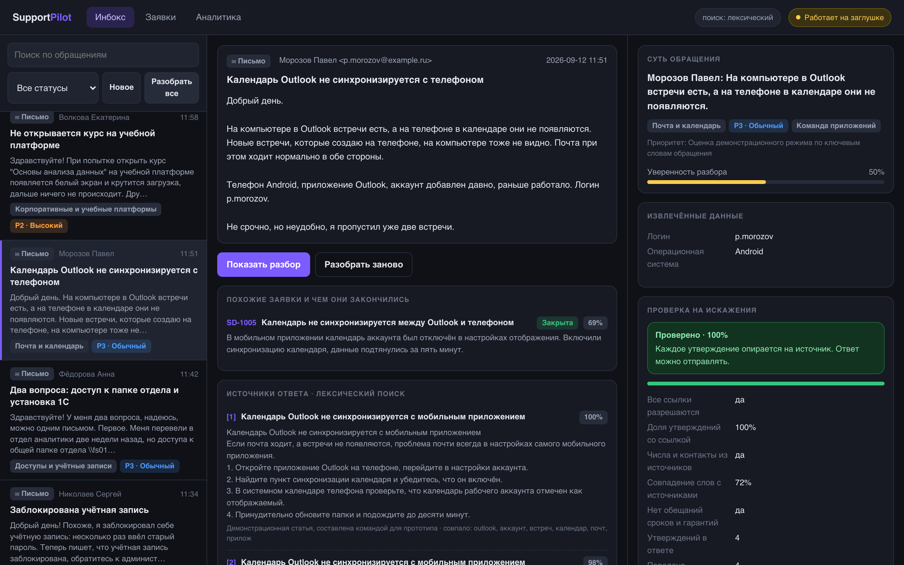
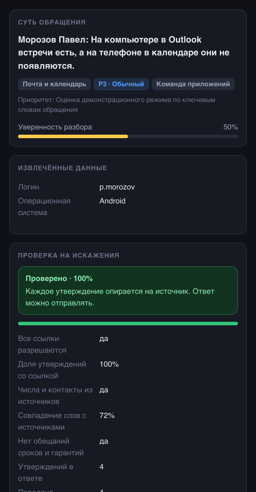
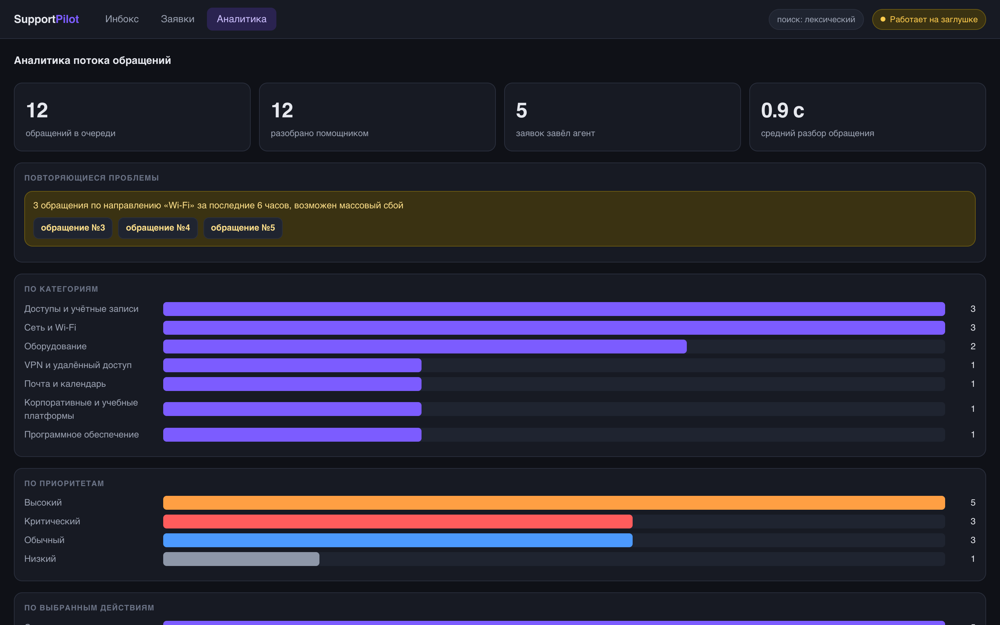

# SupportPilot — ИИ-помощник технической поддержки

Прототип для ShortHack, кейс СберТеха, 12 сентября 2026 года.

Помощник принимает обращение пользователя, разбирает его языковой моделью,
находит ответ в базе знаний, **проверяет собственный ответ на выдумки**
и только потом отдаёт его человеку на подтверждение.



## Кому это нужно

Пользователь продукта — оператор первой линии поддержки, а не сотрудник,
который пишет в поддержку. Через оператора проходит весь поток обращений:
он вчитывается в свободный текст, вытаскивает логин и код ошибки руками,
решает, куда отнести обращение и что делать дальше. SupportPilot делает
эту работу за него и оставляет за человеком решение.

## Как устроен прогон

```
        обращение (письмо или расшифровка звонка)
                        │
 1  модель   Аналитик          свободный текст → структура
                        │
 2  код      Поисковик         похожие закрытые заявки и их решения
 3  код      Поисковик         гибридный поиск по базе знаний (RAG)
                        │
 4  модель   Маршрутизатор     выбор инструмента и его аргументов
                        │
 5  модель   Автор ответа      ответ строго по найденным фрагментам, со ссылками
                        │
 6  код+мод. Проверяющий       проверка на искажения и выдумки
                        │          └─ не прошло → переписать один раз
                        │          └─ снова не прошло → ответ не отправляется
 7  код      Исполнитель       заявка / уточнение / черновик ответа
                        │
             ЧЕЛОВЕК            оператор подтверждает или правит
```

Модель работает на четырёх шагах, остальное делает обычный код. Поиск,
подсчёт повторов, запись в базу и половина проверки на галлюцинации —
это детерминированные задачи: код выполняет их за миллисекунды и всегда
одинаково.

## Проверка на искажения

Это центральная часть проекта. Ответ считается пригодным только тогда,
когда каждое утверждение опирается на переданный фрагмент базы знаний
или на текст самого обращения.

**Первый слой — код, без обращения к модели, миллисекунды.**

| Что проверяем | Зачем |
|---|---|
| Ссылки вида `[1]` разрешаются в реальные фрагменты | Модель любит сослаться на несуществующий источник |
| Каждое утверждение имеет ссылку | Утверждение без опоры — кандидат в выдумки |
| Числа, коды ошибок, телефоны, адреса, сетевые пути | Классическая галлюцинация: выдуманный номер поддержки |
| Обещания сроков, гарантий и оплаты | Помощник не имеет права обещать от лица компании |
| Доля слов ответа, встречающихся в источниках | Ловит вольный пересказ вместо инструкции |

**Второй слой — отдельный вызов модели с противоположной установкой:**
разобрать ответ на утверждения и по каждому сказать, подтверждается оно
источниками или нет. Проверяющий не улучшает ответ и не переписывает его,
он только сверяет.

**Что происходит по итогу.** Ответ с оценкой выше 0,85 и без критических
нарушений помечается проверенным. Ниже — уходит человеку с подсветкой
спорных мест. При критическом нарушении ответ переписывается один раз
с перечнем претензий, и если снова не проходит, готовый ответ не
отправляется вовсе: обращение передаётся человеку с заявкой.

Отправку в любом случае подтверждает оператор. Письма сами никуда не уходят,
заявки сами не закрываются.

## Поиск по базе знаний

Статьи режутся на фрагменты по смысловым блокам: нумерованная инструкция
не разрывается пополам, иначе ответ соберётся из половинок разных процедур.

Поиск гибридный. Лексический слой — BM25 с грубой лемматизацией русских
окончаний и словарём разговорных написаний, чтобы «впн» находило VPN.
Векторный слой подключается, когда доступна модель эмбеддингов. Два списка
объединяются взаимно-ранговым слиянием.

Векторный слой не обязателен: без него поиск продолжает работать, просто
хуже справляется с перефразировками. Состояние видно в шапке интерфейса.

## Запуск

```bash
git clone https://github.com/nighttcrawlerr/ShortHack
cd ShortHack

# бэкенд
cd backend
python3 -m venv .venv && source .venv/bin/activate
pip install -r requirements.txt
cp .env.example .env
uvicorn app.main:app --reload

# фронтенд, во втором терминале
cd frontend
npm install
npm run dev
```

Откройте `http://localhost:5173`.

**Ключ модели не обязателен.** Без него приложение работает в демонстрационном
режиме на разборе по ключевым словам: проходит весь сценарий, включая поиск
и проверку на искажения. Режим честно показан жёлтой плашкой в шапке,
чтобы никто не принял его за работу настоящей модели.

Подробности настройки и список эндпоинтов — в [backend/README.md](backend/README.md).

## Стек

| Слой | Решение |
|---|---|
| Бэкенд | Python, FastAPI, SQLAlchemy, SQLite |
| Модель | GigaChat-2-Pro по протоколу OpenAI, локальный Qwen через Ollama как запасной путь |
| Поиск | BM25 и векторный слой собственной сборки, без внешних зависимостей |
| Фронтенд | React, TypeScript, Vite, обычный CSS |
| Хостинг | Yandex Cloud |

Клиент модели говорит на протоколе OpenAI, поэтому переключение между
GigaChat, Yandex Cloud и локальной моделью — это правка двух строк в `.env`.

## Что не сделано

- Векторный поиск работает только при доступной модели эмбеддингов,
  без неё остаётся лексический.
- База знаний состоит из 20 демонстрационных статей, составленных командой.
  Внутренние регламенты поддержки закрыты, и выдавать выдумку за них мы не стали.
- Расшифровка звонков принимается готовым текстом, аудио не обрабатывается.
- Нет авторизации и разграничения прав: это прототип рабочего места, не система.

## Как это выглядит

| | |
|---|---|
|  |  |
| Проверка ответа на искажения | Поток обращений и массовые сбои |

## Документы команды

| Файл | О чём |
|---|---|
| [docs/00_MASTER_TZ.md](docs/00_MASTER_TZ.md) | Продукт, скоуп, таймлайн, критерии готовности |
| [docs/01_CONTRACT.md](docs/01_CONTRACT.md) | Схема данных, эндпоинты, промпты, схемы ответов |
| [docs/02_DEV_A_BACKEND.md](docs/02_DEV_A_BACKEND.md) | План работ по бэкенду |
| [docs/03_DEV_B_FRONTEND.md](docs/03_DEV_B_FRONTEND.md) | План работ по фронтенду |
| [docs/04_PRESENTER.md](docs/04_PRESENTER.md) | Слайды, скрипт защиты, вопросы жюри |
