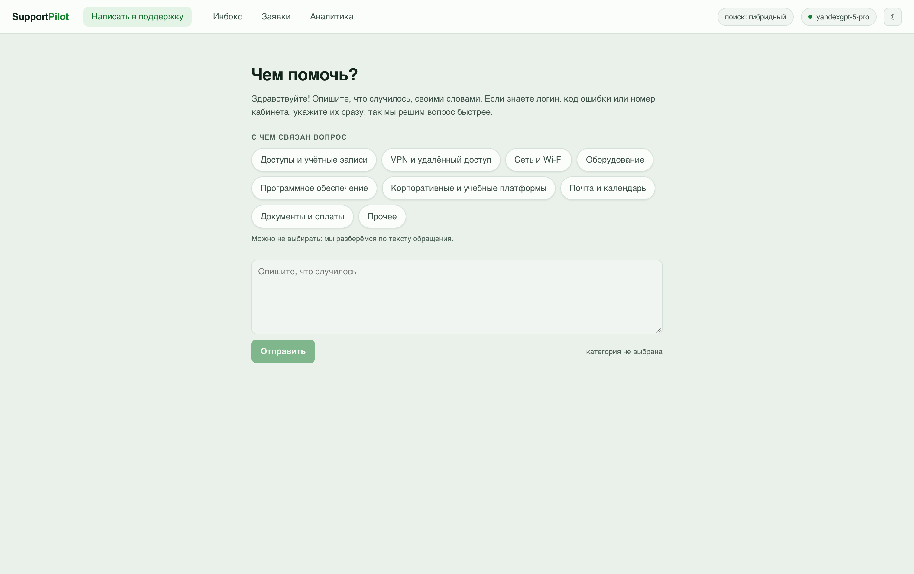
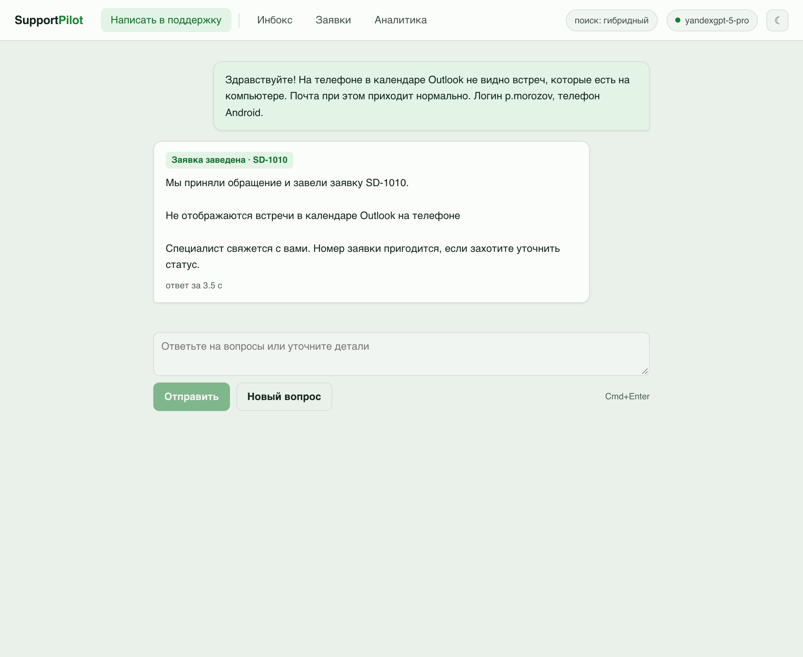
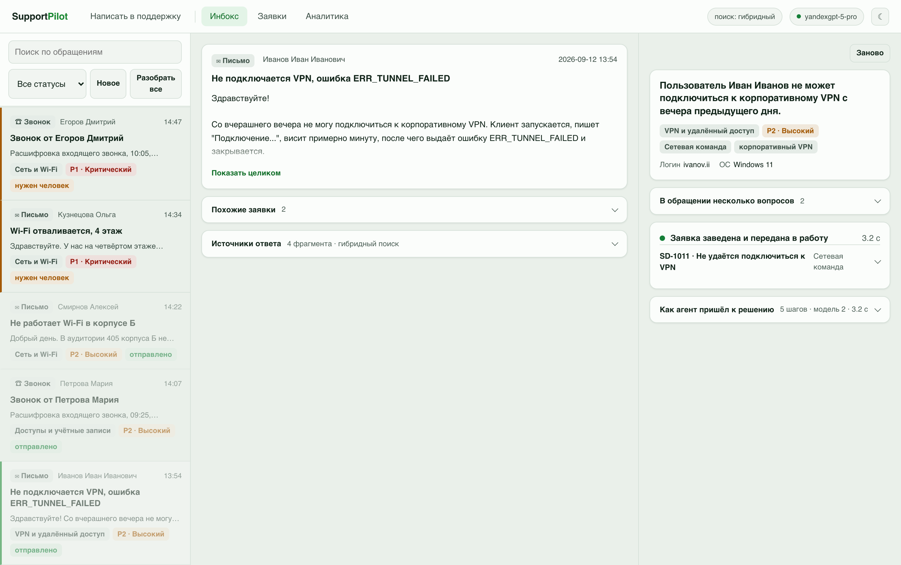

# SaluteAgent — ИИ-помощник технической поддержки

Прототип для ShortHack, кейс СберТеха, 12 сентября 2026 года.

Помощник принимает обращение пользователя, разбирает его языковой моделью,
находит ответ в базе знаний и **проверяет собственный ответ на выдумки**,
прежде чем тот уйдёт пользователю. Проверенный ответ отправляется сразу.
Человек подключается только там, где проверка нашла замечание.



## Развёрнутая версия

| Страница | Адрес | Для кого |
|---|---|---|
| Окно пользователя | http://93.77.186.72/support | Сотрудник, у которого возникла проблема |
| Рабочее место | http://93.77.186.72 | Оператор первой линии поддержки |

Работает на живой модели YandexGPT-5-Pro в Yandex Cloud, поиск гибридный.
Демонстрационная очередь уже разобрана.

## Две стороны продукта

**Окно пользователя, адрес `/support`.** Отдельная страница: человек выбирает,
с чем связан вопрос, описывает проблему
своими словами и получает ответ. В ответе стоят сноски на инструкции, по которым
он составлен. Если данных не хватило, помощник переспрашивает прямо в переписке,
и разговор продолжается.

**Рабочее место оператора, адрес `/`.** Очередь обращений, разбор, проверка, трасса шагов
агента. Сюда попадает то, что помощник не решился отправить сам.

## Кому это нужно

Пользователь продукта — оператор первой линии поддержки, а не сотрудник,
который пишет в поддержку. Через оператора проходит весь поток обращений:
он вчитывается в свободный текст, вытаскивает логин и код ошибки руками,
решает, куда отнести обращение и что делать дальше. SaluteAgent делает
эту работу за него и оставляет за человеком решение.

## Как устроен прогон

```
        обращение (письмо или расшифровка звонка)
                        │
 1  модель   Аналитик          свободный текст → структура
                        │
 2  код      Поисковик         похожие закрытые заявки и их решения
 3  код      Поисковик         гибридный поиск по базе знаний (RAG)
                        │
 4  модель   Маршрутизатор     выбор инструмента и его аргументов
                        │
 5  модель   Автор ответа      ответ строго по найденным фрагментам, со ссылками
                        │
 6  код+мод. Проверяющий       проверка на искажения и выдумки
                        │          └─ не прошло → переписать один раз
                        │          └─ снова не прошло → остановить
                        │
 7  код      Исполнитель       заявка / уточнение / черновик ответа
                        │
            ┌───────────┴────────────┐
   проверка пройдена          есть замечание
            │                        │
   уходит пользователю        ждёт человека
```

Модель работает на четырёх шагах, остальное делает обычный код. Поиск,
подсчёт повторов, запись в базу и половина проверки на галлюцинации —
это детерминированные задачи: код выполняет их за миллисекунды и всегда
одинаково.

## Почему человек не визирует каждый ответ

Подтверждение оператором на каждом обращении — это очередь. Пользователь
ждёт ответа всё то время, пока оператор разгребает поток, и выигрыш
от скорости модели съедается ожиданием визы.

Поэтому человек здесь разбирает исключения, а не визирует поток.
Ответ уходит сам, если он прошёл проверку. Обращение останавливается
и ждёт человека, когда:

- проверка подтвердила не все утверждения ответа;
- ответ не прошёл проверку даже после переписывания;
- в базе знаний не нашлось подходящего материала;
- модель не уверена в разборе;
- приоритет критический.

На демонстрационной очереди из двенадцати обращений девять уходят сами,
три останавливаются. Порог задаётся переменной `AUTO_SEND`.

## Проверка на искажения

Это центральная часть проекта. Ответ считается пригодным только тогда,
когда каждое утверждение опирается на переданный фрагмент базы знаний
или на текст самого обращения.

**Первый слой — код, без обращения к модели, миллисекунды.**

| Что проверяем | Зачем |
|---|---|
| Ссылки вида `[1]` разрешаются в реальные фрагменты | Модель любит сослаться на несуществующий источник |
| Каждое утверждение имеет ссылку | Утверждение без опоры — кандидат в выдумки |
| Числа, коды ошибок, телефоны, адреса, сетевые пути | Классическая галлюцинация: выдуманный номер поддержки |
| Обещания сроков, гарантий и оплаты | Помощник не имеет права обещать от лица компании |
| Доля слов ответа, встречающихся в источниках | Ловит вольный пересказ вместо инструкции |

**Второй слой — отдельный вызов модели с противоположной установкой:**
разобрать ответ на утверждения и по каждому сказать, подтверждается оно
источниками или нет. Проверяющий не улучшает ответ и не переписывает его,
он только сверяет.

**Что происходит по итогу.** Ответ с оценкой выше 0,85 и без критических
нарушений помечается проверенным. Ниже — уходит человеку с подсветкой
спорных мест. При критическом нарушении ответ переписывается один раз
с перечнем претензий, и если снова не проходит, готовый ответ не
отправляется вовсе: обращение передаётся человеку с заявкой.

Отправку в любом случае подтверждает оператор. Письма сами никуда не уходят,
заявки сами не закрываются.

## Поиск по базе знаний

Статьи режутся на фрагменты по смысловым блокам: нумерованная инструкция
не разрывается пополам, иначе ответ соберётся из половинок разных процедур.

Запрос к поиску строится не из письма целиком, а из результата разбора:
суть, сервис, найденный код ошибки. В письме половина текста — приветствие
и описание того, как человек расстроен; для поиска это шум, который тянет
выдачу к статьям с большим числом общих слов.

Поиск гибридный. Лексический слой — BM25 с грубой лемматизацией русских
окончаний и словарём разговорных написаний, чтобы «впн» находило VPN.
Векторный слой использует раздельные модели для документа и для запроса:
короткий вопрос и длинный фрагмент кодируются по-разному, и это заметно
точнее одной модели на оба случая. Списки объединяются взаимно-ранговым
слиянием.

Векторный слой не обязателен: без него поиск продолжает работать, просто
хуже справляется с перефразировками. Состояние видно в шапке интерфейса.

## Чему научен автор ответа

Модель не дообучалась: вместо этого в промпт заложена дисциплина работы
с найденным контекстом. Запрещено отвечать из собственных знаний, если
во фрагментах этого нет. Запрещено склеивать шаги одной процедуры из разных
фрагментов — так получается порядок действий, которого нет ни в одном
источнике. Запрещено распространять частный случай на общий: инструкция
для Windows не подаётся как универсальная. Значения из источника
переписываются буквально, без «улучшений».

Проверяющий ищет ровно эти три отказа отдельными правилами.

## Запуск

```bash
git clone https://github.com/nighttcrawlerr/ShortHack
cd ShortHack

# бэкенд
cd backend
python3 -m venv .venv && source .venv/bin/activate
pip install -r requirements.txt
cp .env.example .env
uvicorn app.main:app --reload

# фронтенд, во втором терминале
cd frontend
npm install
npm run dev
```

Откройте `http://localhost:5173` — рабочее место оператора.
Окно пользователя открывается по адресу `/support`.

**Ключ модели не обязателен.** Без него приложение работает в демонстрационном
режиме на разборе по ключевым словам: проходит весь сценарий, включая поиск
и проверку на искажения. Режим честно показан жёлтой плашкой в шапке,
чтобы никто не принял его за работу настоящей модели.

Подробности настройки и список эндпоинтов — в [backend/README.md](backend/README.md).

## Стек

| Слой | Решение |
|---|---|
| Бэкенд | Python, FastAPI, SQLAlchemy, SQLite |
| Модель | YandexGPT-5-Pro через Yandex Cloud AI Studio, протокол OpenAI |
| Эмбеддинги | text-embeddings-v2, раздельные модели для документа и запроса |
| Поиск | BM25 и векторный слой собственной сборки, без внешних зависимостей |
| Фронтенд | React, TypeScript, Vite, обычный CSS |
| Хостинг | Yandex Cloud |

Клиент модели говорит на протоколе OpenAI, поэтому переключение между
YandexGPT, Qwen3, GigaChat и локальной моделью через Ollama — это правка
двух строк в `.env`. Qwen3 доступен в том же каталоге и включается сменой
`LLM_MODEL`; YandexGPT-5-Pro выбрана за скорость, 0.9 секунды против 3 и 28.

## Что не сделано

- Векторный поиск работает только при доступной модели эмбеддингов,
  без неё остаётся лексический.
- База знаний состоит из 20 демонстрационных статей, составленных командой.
  Внутренние регламенты поддержки закрыты, и выдавать выдумку за них мы не стали.
- Расшифровка звонков принимается готовым текстом, аудио не обрабатывается.
- Нет авторизации и разграничения прав: это прототип рабочего места, не система.

## Как это выглядит

| | |
|---|---|
|  |  |
| Ответ со ссылками на инструкции | Рабочее место оператора |

## Документы команды

| Файл | О чём |
|---|---|
| [docs/00_MASTER_TZ.md](docs/00_MASTER_TZ.md) | Продукт, скоуп, таймлайн, критерии готовности |
| [docs/01_CONTRACT.md](docs/01_CONTRACT.md) | Схема данных, эндпоинты, промпты, схемы ответов |
| [docs/02_DEV_A_BACKEND.md](docs/02_DEV_A_BACKEND.md) | План работ по бэкенду |
| [docs/03_DEV_B_FRONTEND.md](docs/03_DEV_B_FRONTEND.md) | План работ по фронтенду |
| [docs/04_PRESENTER.md](docs/04_PRESENTER.md) | Слайды, скрипт защиты, вопросы жюри |
